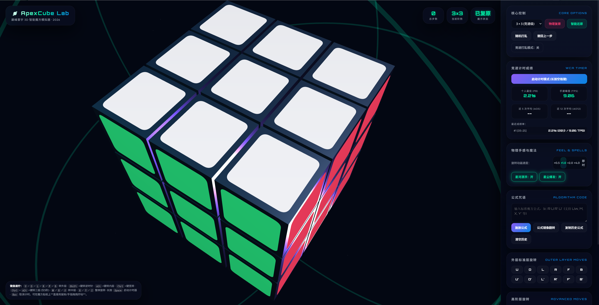

<div align="center">


<br />


<br />
<br />

<p>
  <a href="https://muskke.github.io/apexcube-cosmic-lab/" target="_blank">
    
  </a>
  <a href="https://github.com/muskke/apexcube-cosmic-lab" target="_blank">
    
  </a>
  <a href="https://github.com/muskke/apexcube-cosmic-lab/blob/main/LICENSE" target="_blank">
    
  </a>
</p>

<p>
  
  
  
  
  
  
</p>

<h3>
  <a href="#-live-demo">Live Demo</a>
  <span> · </span>
  <a href="#-showcase">Showcase</a>
  <span> · </span>
  <a href="#-why-it-feels-premium">Highlights</a>
  <span> · </span>
  <a href="#-quick-start">Quick Start</a>
  <span> · </span>
  <a href="#-controls">Controls</a>
  <span> · </span>
  <a href="#-architecture">Architecture</a>
</h3>

<br />

> **ApexCube Cosmic Lab** is a cinematic, high-fidelity Rubik’s Cube simulator built for speedcubers, cube geeks, and interaction design lovers.  
> It blends physically consistent cubie logic with a premium cosmic interface, sticker-level gesture control, WCA-style timing, and smart algorithm workflows.

</div>

---

<div align="center">

## 🚀 Live Demo

<a href="https://muskke.github.io/apexcube-cosmic-lab/" target="_blank">
  
</a>

<br />
<br />

### [https://muskke.github.io/apexcube-cosmic-lab/](https://muskke.github.io/apexcube-cosmic-lab/)

</div>

---

## 🌠 Showcase

<p align="center">
  
</p>
<br />

<table>
  <tr>
    <td width="33%" align="center">
      <h3>🧊 Physical Cube Engine</h3>
      <p>Real cubie-based layer operations across 3×3, 4×4, and 5×5 cubes.</p>
    </td>
    <td width="33%" align="center">
      <h3>🖱️ Sticker-Level Dragging</h3>
      <p>Raycast a visible sticker, drag in 3D space, and turn the correct layer.</p>
    </td>
    <td width="33%" align="center">
      <h3>⏱️ WCA-Inspired Timer</h3>
      <p>Practice with hold-to-ready timing, PB, Ao5, Ao12, TPS, and solve history.</p>
    </td>
  </tr>
  <tr>
    <td width="33%" align="center">
      <h3>⚡ High-Speed Move Queue</h3>
      <p>Non-blocking algorithm input with adaptive acceleration under heavy queues.</p>
    </td>
    <td width="33%" align="center">
      <h3>🧠 Smart Solve Guide</h3>
      <p>Kociemba-style 3×3 restoration pipeline with guided step progression.</p>
    </td>
    <td width="33%" align="center">
      <h3>🌌 Cosmic UI System</h3>
      <p>Glassmorphism panels, neon accents, floating aura, and particle bursts.</p>
    </td>
  </tr>
</table>

---

## ✨ Why It Feels Premium

<table>
  <tr>
    <td width="50%">
      <h3>🎯 Interaction that feels physical</h3>
      <p>
        ApexCube does not rely only on buttons. You can grab a visible sticker directly,
        drag in 3D space, and let the simulator resolve the intended physical layer.
      </p>
      <ul>
        <li>Raycast-based sticker picking</li>
        <li>Local-space drag vector resolution</li>
        <li>Accidental camera-drag suppression</li>
        <li>Mouse and touch support</li>
      </ul>
    </td>
    <td width="50%">
      <h3>🧬 A real cubie model underneath</h3>
      <p>
        Every move is mapped to a real cube-layer operation. The visual rotation is tied
        to a physical state system instead of being a surface-only illusion.
      </p>
      <ul>
        <li>3×3, 4×4, and 5×5 cube orders</li>
        <li>Outer, inner, wide, middle, and whole-cube turns</li>
        <li>State snapping after every move</li>
        <li>Undo, reset, scramble, and solve workflows</li>
      </ul>
    </td>
  </tr>
  <tr>
    <td width="50%">
      <h3>⚡ Built for algorithm speed</h3>
      <p>
        Rapid input should not freeze the experience. ApexCube buffers moves, adapts
        animation speed, and stays responsive during aggressive formula execution.
      </p>
      <ul>
        <li>Non-blocking move queue</li>
        <li>Automatic speed-up when the queue grows</li>
        <li>Instant mode for high-speed drilling</li>
        <li>Formula history and copy workflow</li>
      </ul>
    </td>
    <td width="50%">
      <h3>🌌 Designed like a product</h3>
      <p>
        The interface is built with a cinematic cyber-cosmic style: glass panels, neon
        accents, immersive overlays, and high-contrast cube materials.
      </p>
      <ul>
        <li>Cosmic aurora background</li>
        <li>Glassmorphism dashboard</li>
        <li>Neon cube aura</li>
        <li>Particle burst effects</li>
      </ul>
    </td>
  </tr>
</table>

---

## 🧩 Feature Matrix

| Area | Capability |
| --- | --- |
| Cube orders | 3×3, 4×4, 5×5 |
| Turn types | Outer, inner, wide, three-layer wide, middle, whole-cube |
| Interaction | Mouse drag, touch drag, sticker raycasting, keyboard shortcuts |
| Algorithms | Standard cube notation parser and formula execution |
| Timer | Hold-to-ready flow, fullscreen timer, PB, Ao5, Ao12, TPS |
| Smart solve | Kociemba-style 3×3 solve sequence and guided progression |
| Visuals | WebGL scene, glass UI, neon aura, particle bursts, cosmic grid |
| Storage | Local solve records and personal stats through `localStorage` |
| Build | Zero build step, pure HTML / CSS / JavaScript |

---

## 🛠️ Quick Start

### 1. Clone the repository

```bash
git clone https://github.com/muskke/apexcube-cosmic-lab.git
cd apexcube-cosmic-lab
```

### 2. Open directly

Open `index.html` in your browser.

```txt
index.html
```

### 3. Or run a local static server

Recommended when testing CDN behavior, browser policies, or GitHub Pages deployment.

```bash
python3 -m http.server 5173
```

Then visit:

```txt
http://localhost:5173
```

---

## 🎮 Controls

### Mouse and touch

| Action | Result |
| --- | --- |
| Drag empty space | Orbit the camera |
| Drag a sticker | Turn the corresponding cube layer |
| Scroll wheel | Zoom in or out |
| Touch drag | Mobile-friendly cube interaction |

### Keyboard

| Input | Result |
| --- | --- |
| `U D L R F B` | Outer-layer turns |
| `Shift + U/D/L/R/F/B` | Inverse outer-layer turns |
| `Alt + U/D/L/R/F/B` | Inner-layer turns |
| `Ctrl + U/D/L/R/F/B` | Double-layer wide turns |
| `Ctrl + Alt + U/D/L/R/F/B` | Three-layer wide turns on 5×5 |
| `M E S` | Middle-layer turns |
| `X Y Z` | Whole-cube rotations |
| `Space` | Timer prepare / start / stop |
| `Esc` | Cancel timer |

---

## 🧠 Supported Notation

```txt
U D L R F B
U' D' L' R' F' B'
U2 D2 L2 R2 F2 B2
u d l r f b
Uw Dw Lw Rw Fw Bw
Uw3 Dw3 Lw3 Rw3 Fw3 Bw3
M E S
X Y Z
```

Example algorithms:

```txt
R U R' U'
F R U R' U' F'
Rw U Rw' U'
M E S
X Y Z
```

---

## 🧱 Tech Stack

<div align="center">

| Layer | Technology |
| --- | --- |
| 3D rendering | **Three.js / WebGL** |
| Interaction | **Pointer Events / Raycasting** |
| Cube state | **Cubie-based physical model** |
| Animation | **requestAnimationFrame** |
| Solver | **Kociemba algorithm** |
| Interface | **HTML / CSS / Vanilla JavaScript** |
| Persistence | **localStorage** |

</div>

<br />

<div align="center">

### No build step. No framework lock-in. Just open, run, and play.

</div>

---

## 🏗️ Architecture

```txt
ApexCube Cosmic Lab
├── Scene System
│   ├── Camera
│   ├── Lighting
│   ├── Renderer
│   ├── Cosmic dust
│   └── Neon aura
├── Cube Engine
│   ├── Cubie generation
│   ├── Sticker generation
│   ├── Physical grid state
│   └── State snapping
├── Move System
│   ├── Standard turns
│   ├── Inner-layer turns
│   ├── Wide-layer turns
│   ├── Middle-layer turns
│   ├── Whole-cube rotations
│   └── Notation parser
├── Interaction Layer
│   ├── Raycasting
│   ├── Sticker picking
│   ├── Local drag resolution
│   └── Layer mapping
├── Speed Layer
│   ├── Non-blocking queue
│   ├── Adaptive acceleration
│   ├── Move history
│   └── Undo workflow
├── Practice Layer
│   ├── WCA-style timer
│   ├── PB / Ao5 / Ao12
│   ├── TPS statistics
│   └── Recent solve records
└── Smart Solve Layer
    ├── Kociemba pipeline
    ├── Solve sequence
    ├── Guided move steps
    └── Progress feedback
```

---

## 🧭 Roadmap

- [ ] Full NxN support beyond 5×5
- [ ] Custom sticker color themes
- [ ] Refined mobile gesture physics
- [ ] Import and export scramble states
- [ ] Shareable solve replay links
- [ ] Algorithm replay timeline
- [ ] Sound effects and haptic feedback
- [ ] Offline-first PWA mode
- [ ] Advanced solver support for 4×4 and 5×5
- [ ] Training modes for OLL, PLL, and parity cases

---

## 📁 Recommended Repository Structure

```txt
apexcube-cosmic-lab/
├── index.html
├── README.md
├── README.zh-CN.md
├── LICENSE
└── assets/
    ├── preview.png
    └── demo.gif
```

---

## 🤝 Contributing

Contributions are welcome.

Great areas to improve:

- Sticker-dragging accuracy
- Rendering performance
- Notation parsing
- Mobile interaction quality
- Smart solve guidance
- Preview images and demo GIFs
- Reproducible bug reports

Please keep the project philosophy consistent: **premium visuals, precise interaction, lightweight structure, and no unnecessary build complexity.**

---

## 📄 License

This project is licensed under the **GNU General Public License v3.0 (GPL-3.0)**.

You may use, modify, and distribute this project under the terms of the GPL-3.0 license.

---

## 🙏 Acknowledgements

Built with and inspired by:

- [Three.js](https://threejs.org/)
- Kociemba two-phase solving algorithm
- The global speedcubing community
- Everyone who believes a browser demo can still feel like a premium product

---

<div align="center">


## ⭐ If ApexCube Cosmic Lab feels impressive, consider giving it a Star.

### _Where algorithms, interaction, and cosmic aesthetics meet inside the browser._

<br />

<a href="https://muskke.github.io/apexcube-cosmic-lab/" target="_blank">
  
</a>

</div>
